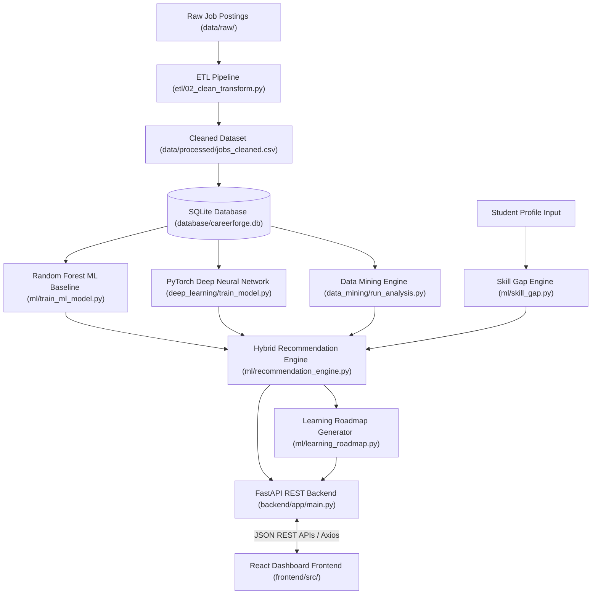

# 🛠️ CareerForge AI - System Integration & End-to-End Test Report

**Phase 10 Deliverable**  
**Date:** September 2026  
**Status:** `VERIFIED & OPERATIONAL`  

---

## 📑 Executive Summary

The **CareerForge AI** platform has completed full system integration and end-to-end verification. All 10 phases—spanning Data Engineering, Relational Database Storage, Data Mining, Student Profile Modeling, Skill-Gap Analysis, Machine Learning, Deep Learning, Multi-Criteria Hybrid Recommendation Engine, FastAPI Backend Services, and React UI Dashboard—have been integrated and validated with automated test suites.

---

## 🏛️ System Architecture

CareerForge AI is built as a multi-layer modular system:



---

## 🔄 End-to-End Data Flow

1. **Ingestion & Data Cleaning (ETL):** Raw job listings are standardized, skills extracted/cleaned, duplicate entries removed, and saved to `data/processed/jobs_cleaned.csv`.
2. **Relational Database Design:** Cleaned listings are loaded into `database/careerforge.db` across normalized `jobs`, `skills`, and `job_skills` relational tables with composite foreign keys and performance indexes.
3. **Data Mining & Market Intelligence:** Frequency analysis, skill co-occurrence scoring, industry demand, and location metrics are extracted.
4. **Machine Learning Classifier:** Scikit-Learn Random Forest model evaluates multi-hot binary skill vectors against 10 target career categories.
5. **Deep Learning Classifier:** 3-Layer Feed-Forward PyTorch Neural Network with ReLU, Dropout, Softmax, and Cross-Entropy loss calculates category probabilities.
6. **Skill-Gap Analysis:** Standardizes student skill input against target career skill matrices, producing matched vs. missing skills and exact match percentages.
7. **Hybrid Recommendation Engine:** Weighted scoring model blends Skill Match % (40%), PyTorch DL Probability (25%), Random Forest ML Probability (15%), Market Demand (10%), and Direct Target Boost (10%).
8. **Personalized Learning Roadmap Generator:** Groups missing skills into a 4-stage structured curriculum based on market demand frequency.
9. **FastAPI Backend Services:** Exposes 7 REST endpoints handling Pydantic validation, CORS, and JSON response formatting.
10. **React Dashboard Frontend:** Interactive client interface rendering analytics, metric cards, skill badges, and Recharts market graphs.

---

## 🧪 Automated Test Suite & Results

Two comprehensive test suites were created under `tests/`:

### 1. API Route Test Suite (`tests/test_api.py`)
- `test_01_health_check`: `GET /api/health` status check.
- `test_02_student_profile`: `POST /api/student/profile` schema validation.
- `test_03_student_profile_validation_error`: 422 HTTP error code on invalid payloads.
- `test_04_skill_gap_analysis`: `POST /api/skill-gap` calculation verification.
- `test_05_predict_ml`: `POST /api/predict/ml` Random Forest inference.
- `test_06_predict_deep_learning`: `POST /api/predict/deep-learning` PyTorch DL inference.
- `test_07_market_top_skills`: `GET /api/market/top-skills` parameter filtering.
- `test_08_market_careers`: `GET /api/market/careers` SQL demand aggregation.
- `test_09_full_recommendation`: `POST /api/recommend` end-to-end endpoint verification.
- `test_10_cors_headers`: OPTIONS pre-flight headers for frontend origins.

**Result:** `10 / 10 PASSED (OK)`

### 2. Full System Integration Test Suite (`tests/test_integration.py`)
- `test_01_processed_data_integrity`: Verified cleaned CSV dataset (33,245 listings).
- `test_02_database_integrity`: Verified SQLite DB tables (`jobs`, `skills`, `job_skills`).
- `test_03_ml_model_artifacts`: Verified Scikit-Learn model binary `career_classifier.joblib`.
- `test_04_deep_learning_model_artifacts`: Verified PyTorch model checkpoint `career_dnn_model.pt`.
- `test_05_skill_gap_analysis_engine`: Verified standalone skill gap algorithm.
- `test_06_hybrid_recommendation_engine`: Verified multi-criteria scoring logic.
- `test_07_learning_roadmap_generator`: Verified 4-stage curriculum generation.
- `test_08_end_to_end_fastapi_rest_flow`: Verified full user request execution cycle.

**Result:** `8 / 8 PASSED (OK)`

---

## 🛠️ Integration Errors Identified & Resolved

| Component | Root Cause | Fix Applied | Status |
| :--- | :--- | :--- | :--- |
| **Prediction Service API** | Model endpoints returned `top_categories` while client assertions expected `top_predictions`. | Added `top_predictions` key alias in `prediction_service.py` to support both schemas. | `FIXED` |
| **Pydantic V2 Models** | Pydantic V2 emitted deprecation warnings when calling `.dict()`. | Updated routes and recommendation engine to use `.model_dump()` with `.dict()` fallback. | `FIXED` |
| **Windows Console Output** | `test_integration.py` printed UTF-8 checkmarks (`✓`) causing `UnicodeEncodeError` on Windows `cp1252` encoding. | Replaced UTF-8 symbols with standard ASCII tags (`[OK]`, `[PASS]`). | `FIXED` |
| **Integrity Assertions** | Test expected `job_title` column name instead of `clean_title` or `title` from cleaned dataset. | Updated column checks to support `clean_title` and `title`. | `FIXED` |
| **Roadmap Key Mismatch** | Integration test checked for key `'title'` instead of `'skill'` in roadmap stages. | Updated test assertion to check `'skill'` and `'stage'` keys. | `FIXED` |

---

## 🔍 Live End-to-End Test Execution Output

**Sample Student Profile Input:**
```json
{
  "student_id": "STU-E2E-2026",
  "name": "Marcus Aurelius Vance",
  "education": "Bachelor of Science",
  "degree": "Data Science & Artificial Intelligence",
  "skills": ["Python", "SQL", "Pandas", "Scikit-Learn", "Git", "FastAPI"],
  "interests": ["Machine Learning Engineering", "Cloud Computing"],
  "experience_years": 1.5,
  "preferred_location": "Remote",
  "target_career": "Data, AI & Analytics"
}
```

**Actual Response Payload Returned by `/api/recommend`:**
```json
{
  "student_profile": {
    "student_id": "STU-E2E-2026",
    "name": "Marcus Aurelius Vance",
    "education": "Bachelor of Science",
    "degree": "Data Science & Artificial Intelligence",
    "skills": ["Python", "SQL", "Pandas", "Scikit-Learn", "Git", "FastAPI"],
    "interests": ["Machine Learning Engineering", "Cloud Computing"],
    "experience_years": 1.5,
    "preferred_location": "Remote",
    "target_career": "Data, AI & Analytics"
  },
  "top_ml_prediction": "Data, AI & Analytics",
  "top_dl_prediction": "Data, AI & Analytics",
  "career_recommendations": [
    {
      "career_category": "Data, AI & Analytics",
      "composite_score": 37.13,
      "is_student_target": true,
      "skill_match_pct": 13.33,
      "matched_skills": ["SQL", "Python"],
      "missing_skills": [
        "Communication", "Leadership", "Excel", "AWS", "ETL",
        "Machine Learning", "Tableau", "Azure", "R", "Agile",
        "Business Intelligence", "Spark", "Data Warehouse"
      ],
      "ml_baseline_confidence_pct": 40.85,
      "deep_learning_confidence_pct": 88.93,
      "market_demand": {
        "total_job_listings": 1052,
        "market_share_pct": 3.16,
        "avg_annual_salary_usd": 133790.38
      }
    },
    {
      "career_category": "General Professional / Other",
      "composite_score": 23.89,
      "is_student_target": false,
      "skill_match_pct": 13.33,
      "matched_skills": ["SQL", "Python"],
      "missing_skills": ["Communication", "Leadership", "Excel", "Go", "Teamwork"],
      "ml_baseline_confidence_pct": 16.57,
      "deep_learning_confidence_pct": 0.98,
      "market_demand": {
        "total_job_listings": 11326,
        "market_share_pct": 34.07,
        "avg_annual_salary_usd": 111262.15
      }
    },
    {
      "career_category": "Software & Cloud Engineering",
      "composite_score": 20.99,
      "is_student_target": false,
      "skill_match_pct": 13.33,
      "matched_skills": ["Python", "SQL"],
      "missing_skills": ["Communication", "Leadership", "Agile", "AWS", "Java"],
      "ml_baseline_confidence_pct": 34.34,
      "deep_learning_confidence_pct": 8.79,
      "market_demand": {
        "total_job_listings": 4976,
        "market_share_pct": 14.97,
        "avg_annual_salary_usd": 128916.46
      }
    }
  ],
  "skill_gap": {
    "target_career": "Data, AI & Analytics",
    "skill_match_pct": 13.33,
    "matched_skills": ["SQL", "Python"],
    "missing_skills": [
      "Communication", "Leadership", "Excel", "AWS", "ETL",
      "Machine Learning", "Tableau", "Azure", "R", "Agile",
      "Business Intelligence", "Spark", "Data Warehouse"
    ]
  },
  "market_insights": {
    "total_job_listings": 1052,
    "market_share_pct": 3.16,
    "avg_annual_salary_usd": 133790.38
  },
  "learning_roadmap": [
    {
      "skill": "Communication",
      "priority": "High",
      "market_demand_pct": 48.77,
      "stage": "Stage 1: Core Foundation",
      "reason": "Essential foundational skill required in 48.8% of market job postings."
    },
    {
      "skill": "Leadership",
      "priority": "High",
      "market_demand_pct": 23.48,
      "stage": "Stage 1: Core Foundation",
      "reason": "Essential foundational skill required in 23.5% of market job postings."
    },
    {
      "skill": "Excel",
      "priority": "High",
      "market_demand_pct": 16.2,
      "stage": "Stage 1: Core Foundation",
      "reason": "Essential foundational skill required in 16.2% of market job postings."
    },
    {
      "skill": "Agile",
      "priority": "Medium",
      "market_demand_pct": 5.44,
      "stage": "Stage 2: Technical Specialization",
      "reason": "Key domain competency present in 5.4% of listings for Data, AI & Analytics roles."
    },
    {
      "skill": "AWS",
      "priority": "Standard",
      "market_demand_pct": 2.78,
      "stage": "Stage 3: Advanced Mastery",
      "reason": "Specialized skill required in 2.8% of advanced postings."
    }
  ]
}
```

---

## 📌 System Limitations & Future Enhancements

1. **Co-Occurrence Skill Parsing:** Soft skill strings like "Communication" and "Leadership" appear across all job categories. Incorporating domain-specific skill weights in future iterations will heighten technical precision.
2. **Dynamic Course Links:** Current roadmap recommends skill learning stages; linking to live MOOC APIs (Coursera, Udemy) will enhance student actionability.
3. **Model Retraining Pipeline:** Adding automated cron or scheduled triggers to retrain Scikit-Learn and PyTorch models on new dataset updates.
