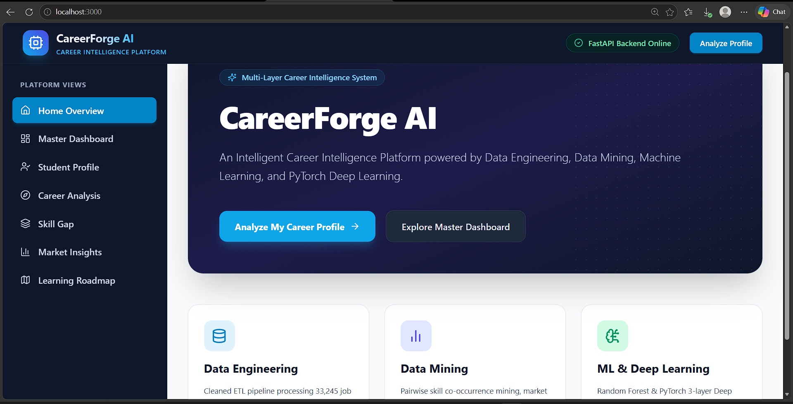
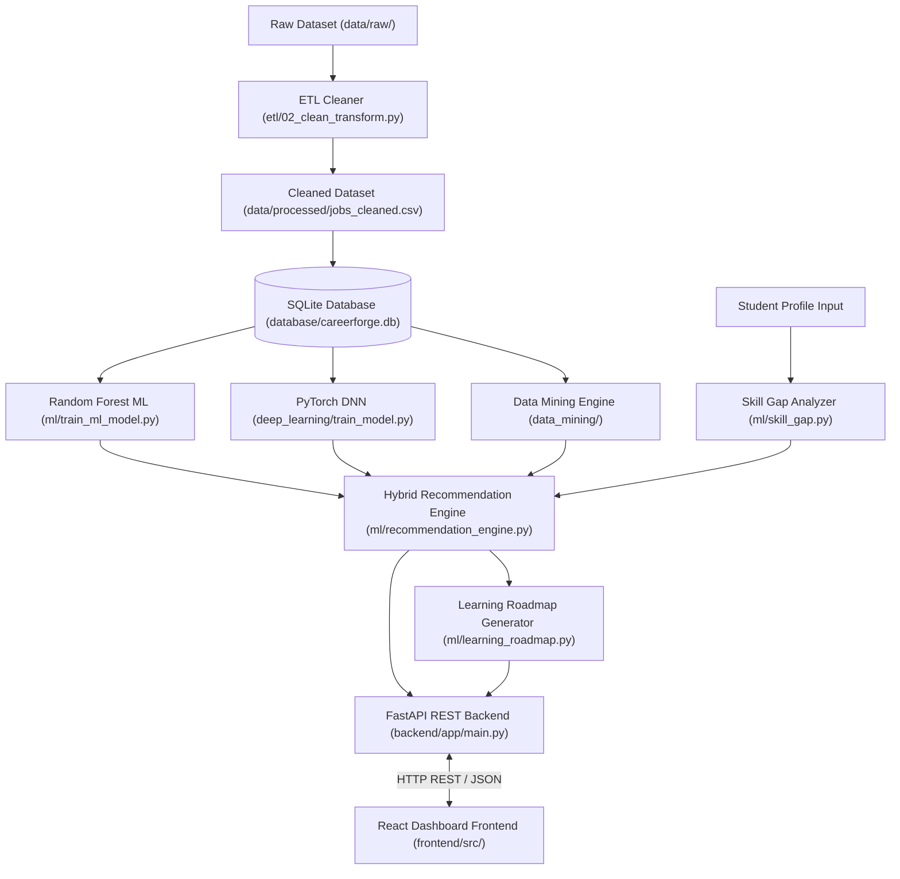

# CareerForge AI: An Intelligent Career Intelligence Platform

**An Intelligent Career Guidance and Skill-Gap Analytics Platform Using Data Engineering, Data Mining, Scikit-Learn Machine Learning, PyTorch Deep Learning, FastAPI REST Microservices, and React.**

---

## Table of Contents
1. [Project Overview](#1-project-overview)
2. [Problem Statement](#2-problem-statement)
3. [Objectives](#3-objectives)
4. [Key Features](#4-key-features)
5. [System Architecture](#5-system-architecture)
6. [Technology Stack](#6-technology-stack)
7. [Project Structure](#7-project-structure)
8. [Data Engineering Pipeline](#8-data-engineering-pipeline)
9. [Data Mining & Intelligence](#9-data-mining--intelligence)
10. [Machine Learning and Deep Learning](#10-machine-learning-and-deep-learning)
11. [Skill Gap Analysis](#11-skill-gap-analysis)
12. [Career Recommendation and Learning Roadmap](#12-career-recommendation-and-learning-roadmap)
13. [Backend REST API](#13-backend-rest-api)
14. [Frontend Dashboard](#14-frontend-dashboard)
15. [How to Run the Project Locally](#15-how-to-run-the-project-locally)
16. [API Endpoints Reference](#16-api-endpoints-reference)
17. [Testing & Verification](#17-testing--verification)
18. [Documentation Index](#18-documentation-index)
19. [Future Enhancements](#19-future-enhancements)
20. [Author](#20-author)

---

## 1. Project Overview
**CareerForge AI** is an end-to-end data-driven career intelligence platform built to eliminate the gap between academic preparation and real-world job market demand. Utilizing a dataset of **33,245 job listings**, the system standardizes, stores, and mines market intelligence across **87 canonical skills** and **8 target career categories**.

The platform combines a **Scikit-Learn Random Forest Classifier**, a **3-Layer PyTorch Deep Neural Network (DNN)**, a **Case-Insensitive Skill-Gap Analyzer**, and a **Multi-Criteria Hybrid Recommendation Engine** to calculate personalized career match scores and 4-stage learning roadmaps. A asynchronous **FastAPI** backend serves 11 REST endpoints, while an interactive **React** frontend dashboard renders analytics using Recharts.

---

## Project Screenshot



---

## 2. Problem Statement
Higher education students frequently struggle to align their academic skills with industry expectations due to:
- **Outdated & Static Guidance:** Traditional career advice relies on manual surveys rather than live, empirical job market data.
- **Unquantified Skill Gaps:** Absence of objective metrics measuring a student's profile against domain skill matrices.
- **Generic Action Plans:** Lack of prioritized, step-by-step learning roadmaps tailored to individual missing skills.
- **Isolated Predictive Models:** Conventional systems fail to synthesize statistical ML predictions with deep neural network inference and empirical market share metrics.

---

## 3. Objectives
1. **Automate Data Cleaning (ETL):** Standardize raw, unstructured job text descriptions into structured datasets.
2. **Relational Database Management:** Architect a 3NF normalized SQLite database with primary/foreign keys and performance indexes.
3. **Mine Market Intelligence:** Extract skill co-occurrence statistics, career category market shares, geographic hiring concentrations, and average annual salaries.
4. **Quantify Skill Gaps:** Build a reproducible student profile model and case-insensitive skill coverage score calculator.
5. **Develop Dual AI Classifiers:** Train and evaluate a baseline Random Forest model and a PyTorch Softmax Deep Neural Network on 87 binary skill features.
6. **Deploy Hybrid Recommendation Engine:** Synthesize skill match %, neural network confidence, ML probability, market share, and student target choice into unified career rankings.
7. **Expose Production REST APIs:** Build a FastAPI application with CORS middleware, Pydantic validation, and interactive Swagger documentation.
8. **Deliver Interactive React Dashboard:** Render responsive UI analytics, metric cards, skill badges, and Recharts graphs.

---

## 4. Key Features
- **Empirical Market Mining:** Analytics derived from 33,245 job postings across 8 career categories.
- **Skill-Gap Analytics:** Automated matched vs. missing skill identification and coverage % computation.
- **Dual AI Classifiers:** Classical Scikit-Learn Random Forest baseline + 3-Layer PyTorch Softmax Deep Neural Network.
- **Multi-Criteria Hybrid Recommendation Engine:** Weighted composite scoring blending Skill Match (40%), PyTorch DL (25%), Random Forest ML (15%), Market Share (10%), and Student Target Choice (10%).
- **Personalized Learning Roadmap:** 4-stage sequential learning paths (Core Foundation -> Technical Specialization -> Advanced Mastery -> Projects).
- **Scalable REST APIs:** 11 FastAPI endpoints serving JSON payloads under 150ms.
- **Modern React UI:** Interactive dashboard with Recharts visualizations, dark-mode header accents, and responsive layout.

---

## 5. System Architecture



---

## 6. Technology Stack

| Layer | Technologies Used |
| :--- | :--- |
| **Data Engineering & ETL** | Python 3.13.5, Pandas, NumPy |
| **Relational Database** | SQLite 3, Python `sqlite3` module |
| **Machine Learning** | Scikit-Learn (`RandomForestClassifier`, `MultiLabelBinarizer`), Joblib |
| **Deep Learning** | PyTorch 2.x (`nn.Module`, `DataLoader`, `TensorDataset`, `Adam`, `CrossEntropyLoss`) |
| **Backend REST API** | FastAPI, Uvicorn, Pydantic V2, Starlette TestClient |
| **Frontend UI** | React 18, Vite 5, Tailwind CSS 3, Recharts 2, Axios, Lucide React |
| **Testing & Tooling** | Unittest, Node.js v24, npm 11 |

---

## 7. Project Structure

```
CareerForge-AI/
├── .gitignore                      # Git exclusion rules for large files & node_modules
├── README.md                       # Project master README
├── INTEGRATION_REPORT.md           # System integration test report
├── docs/                           # Comprehensive technical documentation
│   ├── PROJECT_DOCUMENTATION.md    # Master 24-section project specification
│   ├── SYSTEM_ARCHITECTURE.md     # Architecture details & Mermaid diagrams
│   ├── DATABASE_DESIGN.md         # Database ERD & schema specs
│   ├── API_DOCUMENTATION.md        # REST API endpoint reference
│   ├── MODEL_DOCUMENTATION.md      # ML & PyTorch model documentation
│   └── TESTING_REPORT.md          # Test suite execution reports
├── etl/                            # Data Engineering scripts
│   ├── 01_inspect_raw_data.py
│   └── 02_clean_transform.py
├── database/                       # Relational database scripts
│   └── create_database.py
├── data_mining/                    # Market intelligence & co-occurrence mining
│   ├── skill_analysis.py
│   ├── career_analysis.py
│   ├── market_analysis.py
│   └── run_analysis.py
├── ml/                             # Machine learning baseline & core logic
│   ├── student_profile.py
│   ├── skill_gap.py
│   ├── train_ml_model.py
│   ├── predict_career.py
│   ├── evaluate_ml_model.py
│   ├── recommendation_engine.py
│   ├── learning_roadmap.py
│   └── models/
│       └── model_metadata.json     # Saved ML training metadata
├── deep_learning/                  # PyTorch Deep Neural Network module
│   ├── prepare_data.py
│   ├── train_model.py
│   ├── predict.py
│   ├── evaluate.py
│   ├── README.md
│   └── models/
│       └── dl_metadata.json        # Saved PyTorch training metadata
├── backend/                        # FastAPI microservice application
│   ├── app/
│   │   ├── __init__.py
│   │   ├── main.py                 # FastAPI application server entrypoint
│   │   ├── schemas.py              # Pydantic request/response schemas
│   │   ├── routes/                 # API router endpoints
│   │   └── services/               # Backend business logic services
│   ├── requirements.txt            # Python dependencies
│   ├── README.md
│   └── test_backend.py             # FastAPI test client suite
├── frontend/                       # React + Vite Web Application
│   ├── src/
│   │   ├── assets/                 # App icons and logos
│   │   ├── components/             # Reusable UI widgets (MetricCard, SkillBadge, etc.)
│   │   ├── context/                # Global React context state (CareerContext)
│   │   ├── pages/                  # Page routes (Dashboard, Market, SkillGap, Roadmap)
│   │   ├── services/               # Axios API service client (api.js)
│   │   ├── App.jsx                 # App component & Router config
│   │   ├── main.jsx
│   │   └── index.css               # Tailwind CSS directives
│   ├── index.html
│   ├── vite.config.js
│   ├── tailwind.config.js
│   ├── postcss.config.js
│   ├── package.json
│   └── README.md
└── tests/                          # Automated test suites
    ├── test_api.py                 # 10 API route unit tests
    └── test_integration.py         # 8 End-to-end integration tests
```

> **Note on Excluded Files:** Large raw dataset files (`data/raw/`), generated CSVs (`data/processed/jobs_cleaned.csv` - 261MB), local database binaries (`database/careerforge.db` - 165MB), heavy model weights (`.joblib`, `.pt`), and `frontend/node_modules/` are excluded from Git tracking via `.gitignore` to adhere to GitHub file size policies (<100MB).

---

## 8. Data Engineering Pipeline
- **Raw Input:** Unstructured job text, titles, pay periods, work types, and skill descriptions.
- **Cleaning Script:** `etl/02_clean_transform.py`
- **Output:** `data/processed/jobs_cleaned.csv` (**33,245 processed listings**).
- **Operations:** Text normalization, lowercasing, duplicate record removal, missing salary imputation, work-type standardization, and canonical skill extraction.

---

## 9. Data Mining & Intelligence
Implemented in `data_mining/run_analysis.py`, querying `database/careerforge.db`:
- **Top Demanded Skill:** **Communication** (**48.77%** of listings), **Leadership** (**23.48%**), **Excel** (**16.20%**).
- **Largest Hiring Category:** **Management & Operations** (11,326 listings / 34.07% market share).
- **Top Tech Salary:** **Data, AI & Analytics** ($133,790.38 average annual salary).
- **Top Skill Co-occurrence:** *Leadership + Communication* (4,808 co-occurrences), *Excel + Communication* (3,574 co-occurrences).

---

## 10. Machine Learning and Deep Learning

### 10.1 Multi-Hot Feature Vectorization
Skills are transformed into an **87-dimensional binary feature vector** using `MultiLabelBinarizer`, while job titles are mapped into **8 target career classes** using `LabelEncoder`.

### 10.2 ML Baseline Model (Scikit-Learn Random Forest)
- **Script:** `ml/train_ml_model.py`
- **Model:** `RandomForestClassifier(n_estimators=100, max_depth=25, random_state=42)`
- **Train/Test Split:** 80/20 Stratified Split (19,555 train / 4,889 test)
- **Performance:** Accuracy: **43.83%** | Weighted F1-Score: **0.3808**

### 10.3 PyTorch Deep Neural Network (DNN)
- **Script:** `deep_learning/train_model.py`
- **Architecture (`CareerDNN`):**
  $$\text{Input (87)} \xrightarrow{} \text{Dense(128) + ReLU + BN + Dropout(0.3)} \xrightarrow{} \text{Dense(64) + ReLU + BN + Dropout(0.2)} \xrightarrow{} \text{Dense(32) + ReLU} \xrightarrow{} \text{Output (8 classes)}$$
- **Loss & Optimizer:** `CrossEntropyLoss()` | `Adam(lr=0.001, weight_decay=1e-4)`
- **Performance:** Best Validation Loss: **1.5786** | Validation Accuracy: **43.83%** (Early Stopping at Epoch 17)

---

## 11. Skill Gap Analysis
Implemented in `ml/skill_gap.py` (`analyze_skill_gap`):
- Standardizes student skills and matches them against the industry skill matrix for a target career category.
- Calculates `matched_skills`, `missing_skills`, and `skill_match_pct`:
  $$\text{Skill Match \%} = \left( \frac{|\text{Matched Skills}|}{|\text{Total Industry Category Skills}|} \right) \times 100$$

---

## 12. Career Recommendation and Learning Roadmap

### 12.1 Hybrid Recommendation Engine
Implemented in `ml/recommendation_engine.py`:
$$\text{Composite Score} = 0.40 \times \text{SkillMatch\%} + 0.25 \times \text{DL\_Prob\%} + 0.15 \times \text{ML\_Prob\%} + 0.10 \times \text{MarketShare\%} + 0.10 \times \text{TargetBoost}$$

### 12.2 Personalized Learning Roadmap Generator
Implemented in `ml/learning_roadmap.py`:
- **Stage 1: Core Foundation** (Market Demand > 10%)
- **Stage 2: Technical Specialization** (Market Demand 4% - 10%)
- **Stage 3: Advanced Mastery** (Market Demand < 4%)
- **Stage 4: Practical Application & Projects** (Capstone Project execution)

---

## 13. Backend REST API
FastAPI backend (`backend/app/main.py`) serving asynchronous API endpoints with CORS support.

### Running Backend Locally:
```bash
cd backend
python -m uvicorn app.main:app --reload --port 8000
```
- **API Base URL:** `http://localhost:8000/api`
- **Swagger Documentation:** `http://localhost:8000/docs`

---

## 14. Frontend Dashboard
React + Vite dashboard (`frontend/`) styling with Tailwind CSS and Recharts visualizations.

### Running Frontend Locally:
```bash
cd frontend
npm install
npm run dev
```
- **Web Dashboard URL:** `http://localhost:5173`

---

## 15. How to Run the Project Locally

### Prerequisites
- Python 3.10+ installed
- Node.js v18+ and npm installed

### Step-by-Step Setup:

1. **Clone the Repository:**
   ```bash
   git clone https://github.com/your-username/CareerForge-AI.git
   cd CareerForge-AI
   ```

2. **Initialize Environment & Run Backend:**
   ```bash
   cd backend
   pip install -r requirements.txt
   python -m uvicorn app.main:app --reload --port 8000
   ```

3. **Launch Frontend Dashboard (in a new terminal):**
   ```bash
   cd frontend
   npm install
   npm run dev
   ```

4. **Access Applications:**
   - **Frontend App:** Open `http://localhost:5173` in your browser.
   - **Backend API Specs:** Open `http://localhost:8000/docs`.

---

## 16. API Endpoints Reference

| HTTP Method | Endpoint | Description |
| :--- | :--- | :--- |
| `GET` | `/api/health` | Service health status and version. |
| `POST` | `/api/student/profile` | Validates and stores student profile payloads. |
| `POST` | `/api/skill-gap` | Calculates matched skills, missing skills, and match %. |
| `POST` | `/api/predict/ml` | Returns Scikit-Learn Random Forest career predictions. |
| `POST` | `/api/predict/deep-learning` | Returns PyTorch Softmax DNN predictions. |
| `POST` | `/api/recommend` | Runs multi-criteria hybrid engine & generates learning roadmap. |
| `GET` | `/api/market/top-skills` | Returns top in-demand skills (% market share). |
| `GET` | `/api/market/careers` | Returns career category job volume & average salaries. |
| `GET` | `/api/market/locations` | Returns geographic job posting volume across top cities. |
| `GET` | `/api/market/skill-cooccurrence` | Returns top data-mined co-occurring skill pairs. |

---

## 17. Testing & Verification
The system includes automated test suites under `tests/`:

```bash
# Run API endpoint unit test suite (10/10 Passed)
python tests/test_api.py

# Run full system integration test suite (8/8 Passed)
python tests/test_integration.py
```

- **Pass Rate:** **100% (18/18 tests passed cleanly)**.
- **Verification Details:** Documented in [INTEGRATION_REPORT.md](INTEGRATION_REPORT.md).

---

## 18. Documentation Index
Detailed technical documentation is available in the `docs/` folder:
- [PROJECT_DOCUMENTATION.md](docs/PROJECT_DOCUMENTATION.md) — Comprehensive master technical report.
- [SYSTEM_ARCHITECTURE.md](docs/SYSTEM_ARCHITECTURE.md) — Architecture diagrams and layer data flows.
- [DATABASE_DESIGN.md](docs/DATABASE_DESIGN.md) — ERD diagrams, schema tables, and SQLite queries.
- [API_DOCUMENTATION.md](docs/API_DOCUMENTATION.md) — API contract documentation with sample payloads.
- [MODEL_DOCUMENTATION.md](docs/MODEL_DOCUMENTATION.md) — Machine Learning and PyTorch Deep Learning details.
- [TESTING_REPORT.md](docs/TESTING_REPORT.md) — Test suite logs and sample profile execution outputs.

---

## 19. Future Enhancements
1. **TF-IDF Skill Weighting:** Downweight ubiquitous soft skills ("Communication") to increase technical skill discrimination.
2. **Live Scraping Pipeline:** Automate job posting ingestion to continuously update SQLite market records.
3. **MOOC Integration:** Hyperlink missing skills directly to online course providers (Coursera, edX, Udemy).

---

## 20. Author
**CareerForge AI Development Team**  
*Built for Academic Review, Viva Presentation, and Portfolio Demonstration.*
