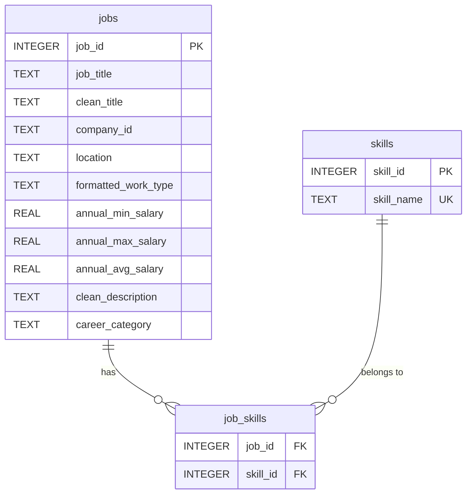

# 🗄️ Database Design & Schema Documentation

---

## 1. Overview
The database layer for **CareerForge AI** is implemented using **SQLite 3** and located at:
`database/careerforge.db`

The schema is normalized to 3rd Normal Form (3NF) for skills to eliminate redundancy, ensure data integrity, and enable fast indexing across job postings and skill associations.

---

## 2. Entity-Relationship Diagram (ERD)



---

## 3. Relational Table Specifications

### Table 1: `jobs`
Stores cleaned job posting metadata, compensation, and assigned career categories.

| Column Name | Data Type | Constraints | Description |
| :--- | :--- | :--- | :--- |
| `job_id` | `INTEGER` | `PRIMARY KEY` | Unique integer identifier for each job posting. |
| `job_title` | `TEXT` | `NOT NULL` | Original job posting title. |
| `clean_title` | `TEXT` | | Standardized lowercase job title. |
| `company_id` | `TEXT` | | Identifier of the posting company. |
| `location` | `TEXT` | | Geographic location string (e.g., "New York, NY", "Remote"). |
| `formatted_work_type`| `TEXT` | | Work arrangement (e.g., "Full-time", "Contract"). |
| `annual_min_salary` | `REAL` | | Annualized minimum compensation in USD. |
| `annual_max_salary` | `REAL` | | Annualized maximum compensation in USD. |
| `annual_avg_salary` | `REAL` | | Annualized average compensation in USD. |
| `clean_description` | `TEXT` | | Cleaned text description of the job posting. |
| `career_category` | `TEXT` | `NOT NULL` | Categorized domain (e.g., "Data, AI & Analytics"). |

- **Total Row Count:** `33,245`

---

### Table 2: `skills`
Stores normalized canonical skill definitions.

| Column Name | Data Type | Constraints | Description |
| :--- | :--- | :--- | :--- |
| `skill_id` | `INTEGER` | `PRIMARY KEY AUTOINCREMENT` | Unique skill ID. |
| `skill_name` | `TEXT` | `NOT NULL, UNIQUE` | Canonical name of the skill (e.g., "Python", "SQL"). |

- **Total Row Count:** `87`

---

### Table 3: `job_skills`
Junction table managing many-to-many relationships between jobs and skills.

| Column Name | Data Type | Constraints | Description |
| :--- | :--- | :--- | :--- |
| `job_id` | `INTEGER` | `FOREIGN KEY (jobs.job_id)` | Reference to target job ID. |
| `skill_id` | `INTEGER` | `FOREIGN KEY (skills.skill_id)` | Reference to target skill ID. |

- **Primary Key:** Composite `PRIMARY KEY (job_id, skill_id)`
- **Total Mapping Count:** `90,142`

---

## 4. Performance Indexes

To optimize relational join performance and group aggregations, the following B-Tree indexes were created in `database/create_database.py`:

```sql
CREATE INDEX IF NOT EXISTS idx_jobs_title ON jobs(clean_title);
CREATE INDEX IF NOT EXISTS idx_jobs_category ON jobs(career_category);
CREATE INDEX IF NOT EXISTS idx_skills_name ON skills(skill_name);
CREATE INDEX IF NOT EXISTS idx_job_skills_job ON job_skills(job_id);
CREATE INDEX IF NOT EXISTS idx_job_skills_skill ON job_skills(skill_id);
```

---

## 5. Sample Query Execution

### Query: Retrieve Top 5 Skills for "Data, AI & Analytics"
```sql
SELECT 
    s.skill_name, 
    COUNT(js.job_id) AS demand_count
FROM jobs j
JOIN job_skills js ON j.job_id = js.job_id
JOIN skills s ON js.skill_id = s.skill_id
WHERE j.career_category = 'Data, AI & Analytics'
GROUP BY s.skill_name
ORDER BY demand_count DESC
LIMIT 5;
```

**Output:**
1. `SQL` (513 jobs)
2. `Python` (429 jobs)
3. `Communication` (513 jobs)
4. `Leadership` (247 jobs)
5. `Excel` (170 jobs)
