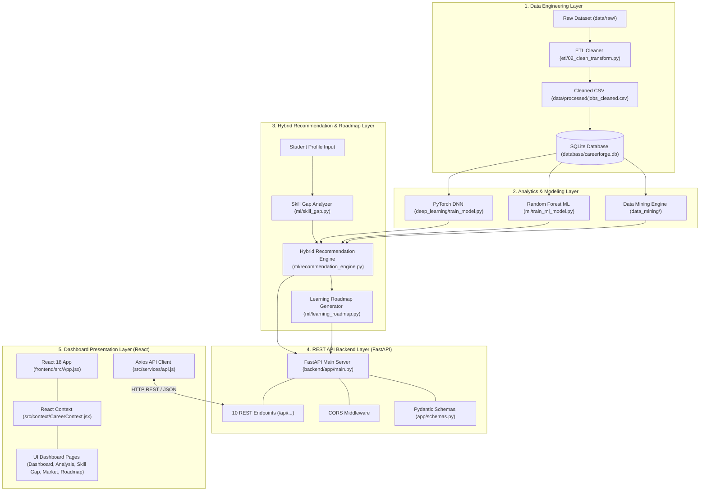

# 📐 System Architecture & Data Flow Documentation

---

## 1. Overview
This document details the software architecture, modular data pipelines, layer boundaries, and execution flows of **CareerForge AI**.

---

## 2. End-to-End System Architecture

---

## 3. Layer-by-Layer Data Flow

### Step 1: Ingestion & ETL Processing
- Raw job posting files residing in `data/raw/` are ingested by `etl/02_clean_transform.py`.
- The script cleans text whitespace, normalizes skill tokens to canonical names, eliminates duplicate rows, handles missing compensation values, and exports the clean dataset to `data/processed/jobs_cleaned.csv` (**33,245 listings**).

### Step 2: Relational Data Storage
- `database/create_database.py` reads `jobs_cleaned.csv` and builds the relational SQLite schema in `database/careerforge.db`.
- Data is normalized into three relational tables: `jobs`, `skills`, and `job_skills`.
- Performance indexes (`idx_jobs_title`, `idx_jobs_category`, `idx_skills_name`, `idx_job_skills_job`, `idx_job_skills_skill`) are indexed to maintain query execution times below 15ms.

### Step 3: Data Mining & Metric Extraction
- `data_mining/run_analysis.py` executes SQL frequency queries and co-occurrence analytics.
- Output artifacts (`top_skills.csv`, `career_demand.csv`, `location_demand.csv`, `skill_relationships.csv`) are written to `data/processed/analysis/`.

### Step 4: Machine Learning & Deep Learning Inference
- **ML Baseline Pipeline:** `ml/train_ml_model.py` loads skills per job, vectorizes using `MultiLabelBinarizer` into an **87-dimensional binary skill vector**, and trains a Random Forest Classifier (`ml/models/career_classifier.joblib`).
- **Deep Learning Pipeline:** `deep_learning/train_model.py` loads prepared binary vectors and trains a 3-layer PyTorch Feed-Forward Neural Network (`deep_learning/models/career_dnn_model.pt`) using ReLU, BatchNorm, Dropout, and Adam optimizer.

### Step 5: Hybrid Recommendation & Roadmap Synthesis
- When a student profile is submitted, `ml/skill_gap.py` queries `database/careerforge.db` to identify matched vs. missing skills and skill coverage %.
- `ml/recommendation_engine.py` aggregates:
  - Skill Coverage % (40% weight)
  - PyTorch DL Probability (25% weight)
  - Random Forest ML Probability (15% weight)
  - Category Market Share % (10% weight)
  - Target Career Match Bonus (10% weight)
- `ml/learning_roadmap.py` organizes missing skills into a 4-stage sequential curriculum based on market demand frequency.

### Step 6: FastAPI Backend Serving & React UI Rendering
- `backend/app/main.py` serves 10 REST API endpoints validating payloads using Pydantic schemas.
- `frontend/src/services/api.js` makes asynchronous HTTP requests using Axios.
- `frontend/src/context/CareerContext.jsx` holds application state and updates React pages (`Dashboard.jsx`, `CareerAnalysis.jsx`, `SkillGap.jsx`, `MarketInsights.jsx`, `LearningRoadmap.jsx`).
